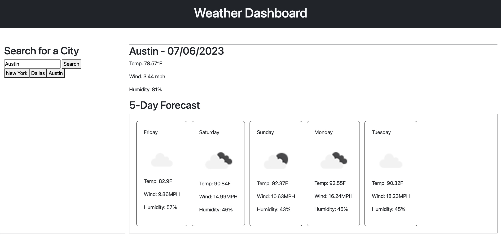

# Weather Dashboard

## Description

This project shows a dashboard that allows a user to search a few weather details for any city in the United States. Users will then be able to see current and 5-day data for temperature, wind, and humidity. Cities that have already been searched will also be stored on the left panel.

This project helped me in the following ways: 
-Created and leveraged API data from the OpenWeather website 
-Gained more experience utilizing JavaScript to dynamically create, adjust, and append data to the application. 
-Experimented with the Bootstrap CSS framework 
-Utilized local storage to store city data 

## Usage

You can view the weather dashboard at the following link:

https://shbunch.github.io/weather-dashboard/

## Credits

SMU Coding Boot Camp

OpenWeatherMap API - https://openweathermap.org/api